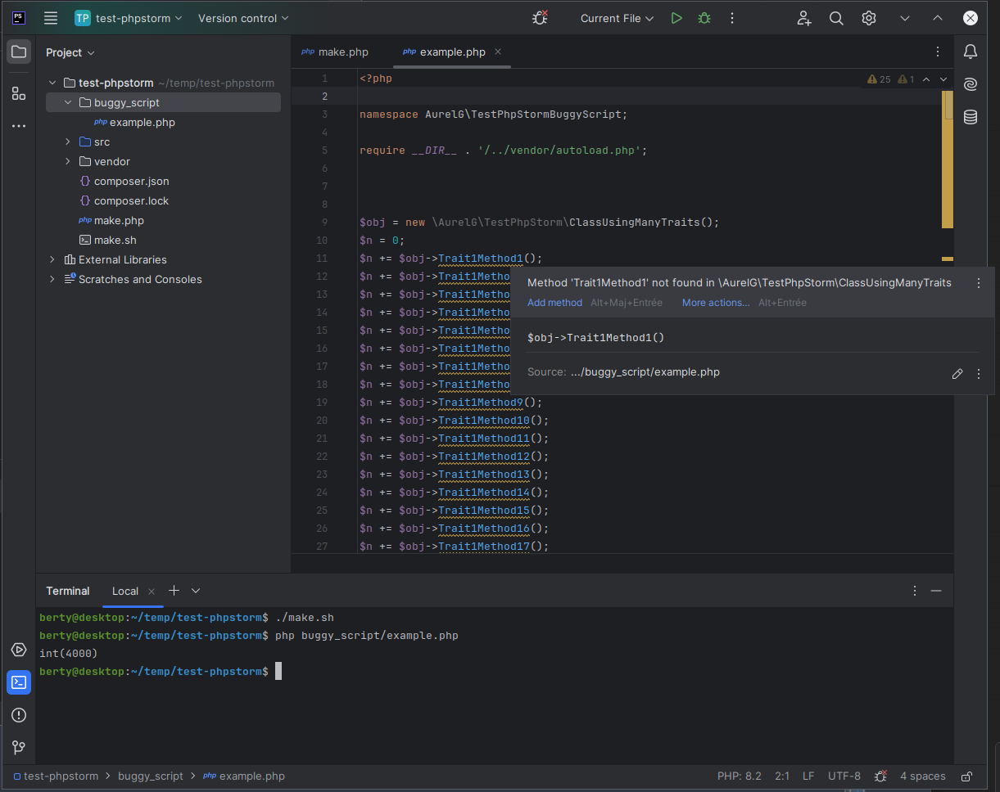

Demonstrates a probable bug in PhpStorm when a class uses many traits and/or these traits have many methods.

The IDE seems to fail to parse the methods of the class. Sometimes the problem occurs after closing and reopening the project.
It seems that sometimes, modifying the class (for example swapping the order of the "use" statements) forces PhpStorm to correctly re-parse the class and temporarily fixes the problem, but it happens again later.
In the real, more complex project where I discovered this problem, I even had problems opening scripts that used the affected class (infinite loading) and even unfolding a folder containing one of these scripts in the explorer.

The example script shows that the PHP code is correct and works. So this seems to be related to a limitation of PhpStorm?

See `make.sh` to regenerate the example with a different number of traits/methods...
